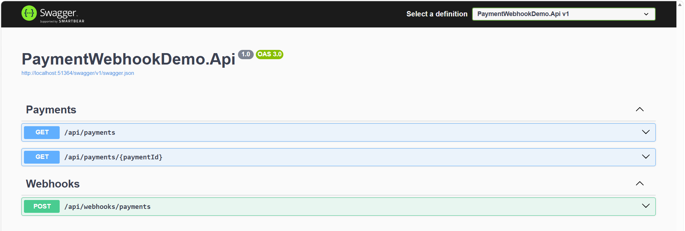
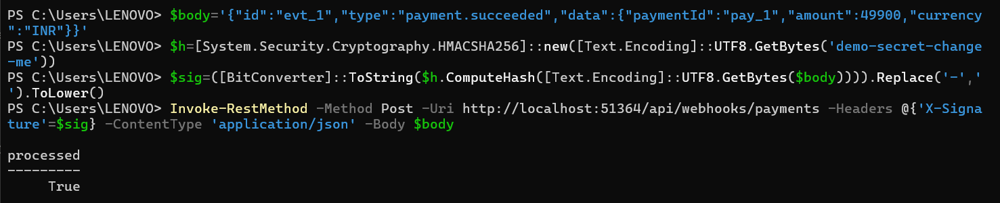
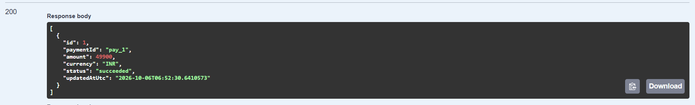

# Payment Webhook Demo (ASP.NET Core Web API)

A small, self-contained example of how I build **secure, idempotent payment webhook receivers** in ASP.NET Core.
It is an original demo project: it uses a generic, made-up event format and contains no client or employer code or data.

## What it shows
- **HMAC-SHA256 signature verification** over the raw request body, with a constant-time comparison (`X-Signature` header)
- **Idempotency**: provider retries are safe, because each event id is stored once (unique index) and duplicates are acknowledged without re-processing
- Payment status updates (`succeeded`, `failed`, `refunded`), including later events overriding earlier ones
- Unknown event types are acknowledged (HTTP 200) so the provider doesn't keep retrying
- EF Core + SQLite (zero setup); swap `UseSqlite` for `UseSqlServer` to run on SQL Server
- Swagger UI, xUnit unit + integration tests (`WebApplicationFactory`)

## Screenshots

**Swagger UI**



**Signed webhook accepted** (HMAC-SHA256 verified, event processed)



**Resulting payment** (`GET /api/payments`)



## Requirements
.NET 8 SDK

## Run
```bash
dotnet run --project src/PaymentWebhookDemo.Api
```
Open `/swagger` on the address printed in the console (for example `http://localhost:5000/swagger`; the port depends on your launch settings).

## Send a test webhook (PowerShell)
Use the port from the console output. The signature is the HMAC-SHA256 hex of the exact body, using the secret in `appsettings.json`:
```powershell
$body='{"id":"evt_1","type":"payment.succeeded","data":{"paymentId":"pay_1","amount":49900,"currency":"INR"}}'
$h=[System.Security.Cryptography.HMACSHA256]::new([Text.Encoding]::UTF8.GetBytes('demo-secret-change-me'))
$sig=([BitConverter]::ToString($h.ComputeHash([Text.Encoding]::UTF8.GetBytes($body)))).Replace('-','').ToLower()
Invoke-RestMethod -Method Post -Uri http://localhost:5000/api/webhooks/payments -Headers @{'X-Signature'=$sig} -ContentType 'application/json' -Body $body
Invoke-RestMethod http://localhost:5000/api/payments/pay_1
```
Sending the same body again returns `duplicate: True`. A wrong signature returns HTTP 401.

## Test
```bash
dotnet test tests/PaymentWebhookDemo.Tests
```

## Notes
The secret in `appsettings.json` is a placeholder. In real projects, use user-secrets or environment variables, never commit real keys.
